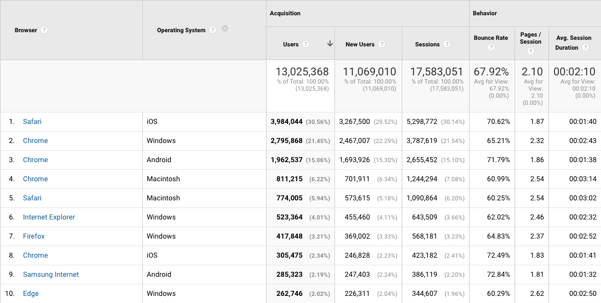

# Lonely Planet's browserslist config

```
npm i lonelyplanet/browserslist-config -D
```

Add this to your `package.json`.

```
"browserslist": [
  "extends @lonelyplanet/browserslist-config"
],
```

## What browsers do we support?

Run `npm run lp-browsers` in your terminal.

## Browsers from January 2018


